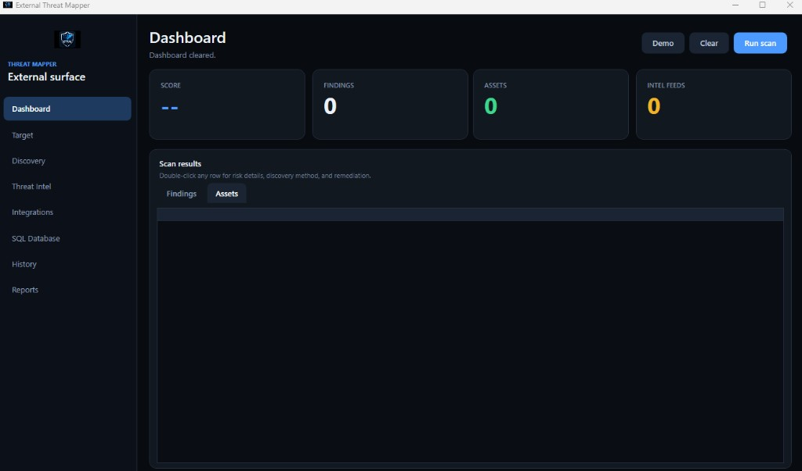
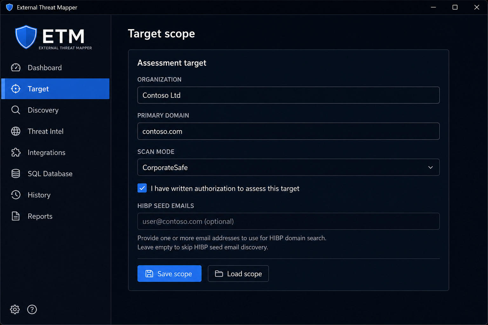
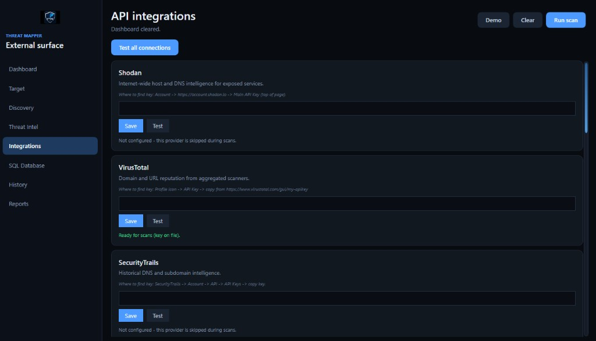
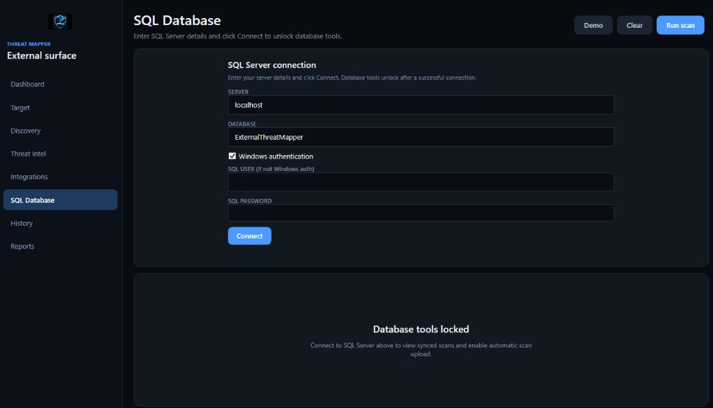
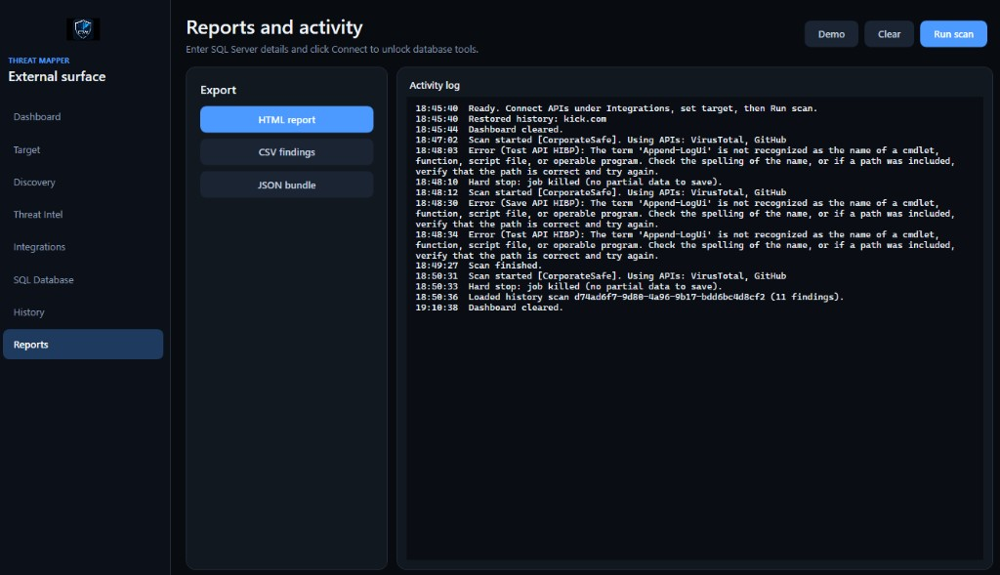

# External Threat Mapper

<p align="center">
  
</p>

<p align="center">
  <a href="https://github.com/Camerenjackson/external-threat-mapper/blob/master/LICENSE"></a>
  
  
  
</p>

<p align="center">
  <strong>Defensive external attack surface dashboard for Windows</strong><br/>
  Map what is exposed on the internet · enrich with threat-intel APIs · keep results local
</p>

> **Authorized assessments only.** Use on targets you own or are permitted to test.

**Repository:** [github.com/Camerenjackson/external-threat-mapper](https://github.com/Camerenjackson/external-threat-mapper)

---

## What is External Threat Mapper?

**External Threat Mapper (ETM)** is a Windows desktop app for **defensive security teams** and analysts who need a clear picture of what is visible on the public internet for an organization. It combines passive discovery (certificate transparency, DNS, safe web probes) with optional **threat-intelligence APIs** and **Have I Been Pwned** breach checks—then presents everything in one dark-themed WPF dashboard.

You define an authorized target, connect the APIs you have, run a scan, and review **findings**, **assets**, and **intel feeds** with remediation-oriented detail. Results stay on your machine (`data/history/`), with optional export to HTML/CSV/JSON and optional **SQL Server** sync for teams.

Built with **PowerShell 5.1+** and **WPF**; can also run headless via CLI or Docker.

---

## Tour of the application

### Dashboard — command center

The **Dashboard** is where you run and monitor scans. Four score cards summarize **risk score**, **findings**, **discovered assets**, and **intel feed** hits. Below that, tabbed grids list **Findings** and **Assets**; double-click any row for severity, evidence, discovery method, and remediation guidance.

Use **Demo** to load sample data without APIs, **Clear** to reset the view, and **Run scan** / **Stop** for live assessments.

<p align="center">
  
</p>

---

### Target — scope and authorization

On **Target**, you set the **organization**, **primary domain**, and **scan mode** (e.g. `PassiveOnly` or `CorporateSafe`). You must confirm **written authorization** before scanning—ETM is designed for legitimate assessments only.

**HIBP seed emails** (optional): corporate scans use HIBP domain search for `@yourdomain` aliases when the domain is verified in your HIBP subscription; you can add up to five specific emails if you are authorized to check them. **Save scope** / **Load scope** persist settings locally (not in git).

<p align="center">
  
</p>

---

### Integrations — API keys with guidance

**Integrations** is where you connect external services. Each provider card explains what it does and **where to find your API key** (with links). **Save** stores keys under `credentials/` (DPAPI-protected on Windows). **Test** validates a single provider; **Test all connections** checks everything at once.

Only configured providers run during scans—others are skipped automatically. Supported sources include **Shodan**, **VirusTotal**, **SecurityTrails**, **Censys**, **urlscan.io**, **AbuseIPDB**, **GreyNoise**, **AlienVault OTX**, **GitHub** (metadata search), and **HIBP**.

<p align="center">
  
</p>

---

### SQL Database — team sync (optional)

**SQL Database** lets you point ETM at a **SQL Server** instance (`localhost` or remote). Use **Windows authentication** or SQL login. After **Connect**, database tools unlock for viewing synced scans and optional automatic upload of new results—useful when multiple analysts share one store.

<p align="center">
  
</p>

---

### Reports — exports and live activity

**Reports** provides one-click export to **HTML report**, **CSV findings**, or **JSON bundle** for stakeholders and ticketing systems. The **activity log** streams scan progress, API usage, and errors in real time so you can troubleshoot without leaving the GUI.

<p align="center">
  
</p>

---

### More tabs (not shown above)

| Tab | What it does |
|-----|----------------|
| **Discovery** | Subdomains, certificates, and hosts found during the scan |
| **Threat Intel** | Aggregated reputation and exposure rows from configured APIs |
| **History** | Reload and compare past assessments from local storage |

See [docs/API-INTEGRATIONS.md](docs/API-INTEGRATIONS.md) for how APIs are chained during a scan.

---

## Feature summary

| Capability | Details |
|------------|---------|
| **Scan modes** | Passive / corporate-safe options; no exploitation |
| **Discovery** | CT, DNS, web probe, Shodan DNS + SecurityTrails merge |
| **Threat intel** | Domain pass + IP/hostname cascade (VT, Shodan host, AbuseIPDB, etc.) |
| **Breach exposure** | HIBP `breacheddomain`, stealer logs, optional seed emails |
| **Risk detail** | Double-click rows; MITRE mapping and remediation text |
| **Secrets** | DPAPI, env vars (`ETM_*`), or Docker `.env` — never in repo |
| **CLI & Docker** | Headless scans and HTTP API for automation |

---

## Quick start

| Action | Command |
|--------|---------|
| **GUI** | Double-click `Launch-ETM.cmd` |
| **GUI (PowerShell)** | `powershell -STA -File .\Scripts\Start-ExternalThreatMapper.ps1` |
| **CLI scan** | `powershell -File .\Scripts\Start-ExternalThreatMapper.ps1 -Domain example.com` |
| **Test APIs** | `powershell -File .\Scripts\Start-ExternalThreatMapper.ps1 -TestApis` |

See [GETTING-STARTED.md](GETTING-STARTED.md) for a plain-language walkthrough.

## API keys (never committed)

Keys stay on your machine only:

- **GUI:** Integrations tab → `credentials/` (DPAPI-protected)
- **Environment:** `ETM_*` variables (see `config/integrations.json`)
- **Docker:** copy `docker/.env.example` → `docker/.env`

Copy `config/config.example.json` → `config/config.json` for scan settings.

## Requirements

- Windows 10/11
- PowerShell 5.1+ (7 recommended)
- For `.exe` build: Python 3.10+

## Project layout

```
ExternalThreatMapper/
├── Launch-ETM.cmd
├── Scripts/          # Start script, build, tests
├── UI/               # WPF interface
├── Modules/          # Scan + API logic
├── docker/
├── data/history/     # Local scans (gitignored)
└── config/
```

See [docs/PROJECT-STRUCTURE.md](docs/PROJECT-STRUCTURE.md).

## Security

See [SECURITY.md](SECURITY.md). Do not commit `config/config.json`, `credentials/`, `scopes/current-scope.json`, or scan output under `data/` or `reports/`.

## License

MIT — see [LICENSE](LICENSE).
