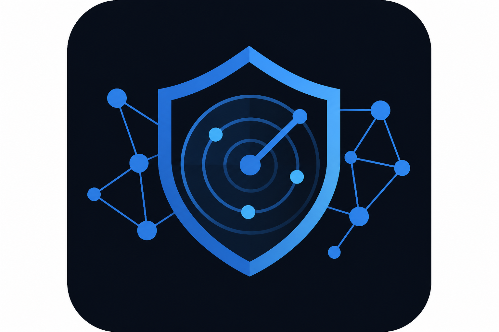
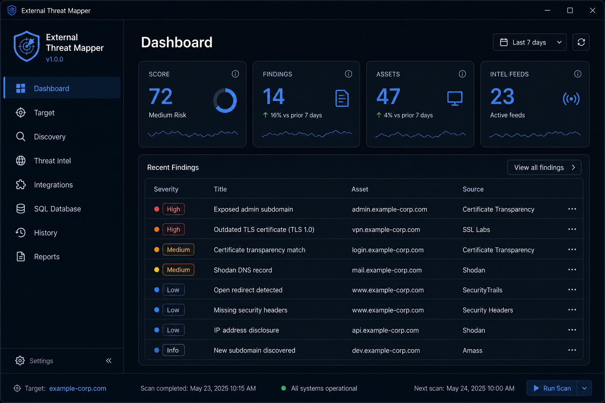

# External Threat Mapper

<p align="center">
  
</p>

<p align="center">
  <a href="https://github.com/Camerenjackson/external-threat-mapper/blob/master/LICENSE"></a>
  
  
  
</p>

<p align="center">
  <strong>Defensive external attack surface dashboard for Windows</strong><br/>
  Map what is exposed on the internet · enrich with threat-intel APIs · keep results local
</p>

> **Authorized assessments only.** Use on targets you own or are permitted to test.


---

## See it in action

<p align="center">
  
</p>

<p align="center"><em>
  Dashboard view: risk score, findings/assets counts, and drill-down tables — double-click any row for full detail.
</em></p>

---

## What you get

| | |
|---|---|
| **One-click scans** | Run passive or corporate-safe scans from the GUI or PowerShell CLI |
| **Live dashboard** | Score, findings, discovered assets, and intel feed counts at a glance |
| **Deep detail** | Double-click rows for severity, evidence, MITRE mapping, and remediation hints |
| **API enrichment** | Shodan, VirusTotal, SecurityTrails, Censys, urlscan, AbuseIPDB, GreyNoise, OTX, GitHub, HIBP |
| **Breach exposure** | HIBP domain search (verified org domains) plus optional seed-email checks |
| **Discovery pipeline** | CT logs, DNS, web probes, and API-assisted subdomain merge |
| **History & reports** | Auto-saved scans under `data/history/` and exportable JSON reports |
| **Enterprise options** | DPAPI-protected API keys, optional SQL Server sync, Docker headless mode |

### Navigation at a glance

| Tab | Purpose |
|-----|---------|
| **Dashboard** | Run/stop scans, score card, findings & assets grids |
| **Target** | Organization, domain scope, authorization, scan mode |
| **Discovery** | Subdomains, certificates, and discovered hosts |
| **Threat Intel** | Aggregated reputation and exposure from configured APIs |
| **Integrations** | API keys with built-in “where to find key” guidance |
| **History** | Reload and compare past assessments |
| **Reports** | Export results for stakeholders |

---

## Quick start

| Action | Command |
|--------|---------|
| **GUI** | Double-click `Launch-ETM.cmd` |
| **GUI (PowerShell)** | `powershell -STA -File .\Scripts\Start-ExternalThreatMapper.ps1` |
| **CLI scan** | `powershell -File .\Scripts\Start-ExternalThreatMapper.ps1 -Domain example.com` |
| **Test APIs** | `powershell -File .\Scripts\Start-ExternalThreatMapper.ps1 -TestApis` |

See [GETTING-STARTED.md](GETTING-STARTED.md) for a plain-language walkthrough.

## API keys (never committed)

Keys stay on your machine only:

- **GUI:** Integrations tab → stored under `credentials/` (DPAPI-protected)
- **Environment:** `ETM_*` variables (see `config/integrations.json`)
- **Docker:** copy `docker/.env.example` → `docker/.env`

Copy `config/config.example.json` → `config/config.json` for scan settings. These paths are listed in `.gitignore`.

## Requirements

- Windows 10/11
- PowerShell 5.1+ (7 recommended)
- For `.exe` build: Python 3.10+

## Project layout

```
ExternalThreatMapper/
├── Launch-ETM.cmd              # Double-click launcher
├── ExternalThreatMapper.psm1   # Module entry
├── Scripts/                    # Start script, build, tests
├── launcher/                   # Python GUI launcher + PyInstaller entry
├── UI/                         # WPF interface
├── Modules/                    # Scan + API logic
├── docker/                     # Dockerfile, .env.example
├── data/history/               # Saved scans (local, gitignored)
└── config/                     # App + integrations config
```

See [docs/PROJECT-STRUCTURE.md](docs/PROJECT-STRUCTURE.md) and [docs/API-INTEGRATIONS.md](docs/API-INTEGRATIONS.md).

## Security

See [SECURITY.md](SECURITY.md). Do not commit `config/config.json`, `credentials/`, `scopes/current-scope.json`, or scan output under `data/` or `reports/`.

## License

MIT — see [LICENSE](LICENSE).
